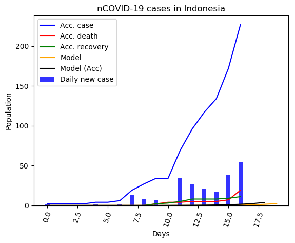
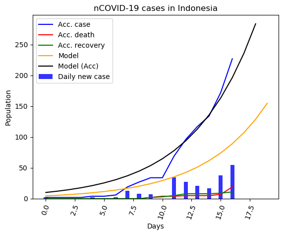

# CV19

Simple simulation on COVID-19 number of cases projection in Indonesia.

Content:

- [Data](#data)
- [Paper reference](#paper-reference)
- [Sample of results](#sample-of-results)
    + [Using original parameters](#using-original-parameters)
    + [Using modified parameters](#using-modified-parameters)

## Data

Data source: http://kcov.id/daftarpositif

    Original data from the website was downloaded in csv format.
    CSV filename: daily.csv
    Data was read in from the csv file

## Paper reference

Mathematical model was taken from http://eprints.itb.ac.id/119/

\[1\] Nuraini, Nuning and Khairudin, Kamal and Apri, Mochamad
Data dan Simulasi COVID-19 dipandang dari Pendekatan Model Matematika.
Preprint. (Submitted)

## Objective

At first instance, originally this was an attempt to find mathematical model
to the rate of change of number of COVID-19 cases in Indonesia as it progresses. However,
it turns out that some preliminary results was already published in `[1]`,
and accordingly the original purpose was slightly shifted into replicating
the results in \[1]\, and if possible, do some refinements to the model.

## Sample of results

### Using original parameters

The following results was obtained by using the original parameters for
 Korean model given in \[1\]. As we can see both from the figure as well
 as from the RMSE value, the results using this parameter model
 is inadequate.

    K = 8495    r = 0.2000      alpha = 0.41000     t_m = 40.1200   RMSE = 359.110836

### Using modified parameters

In light of the inadequate result from using the original parameters
(Korean model) given in the reference, different values for the parameter
was used. We can see some improvement in terms of the RMSE value, reflected
by the closeness of the predicted model with respect to the actual data
in the graph.

    K = 8495    r = 0.2000      alpha = 1.07654    t_m = 40.1200   RMSE = 71.122767

